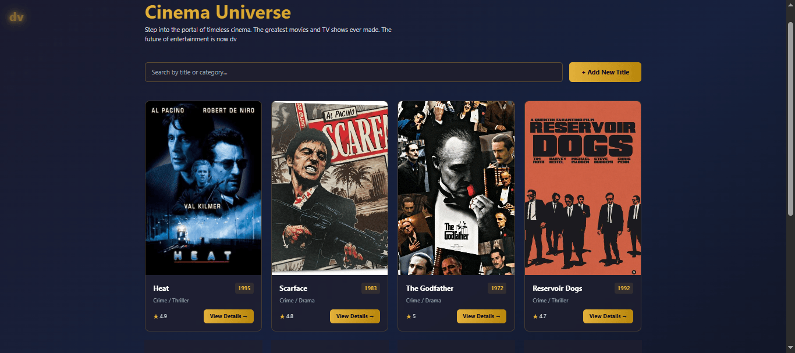

# 🎬 deVere Cinema Universe

Welcome to the **deVere Cinema Universe** — a place where you can explore the greatest movies and TV shows ever made. Think of it as your personal digital library of iconic cinema.

Browse titles, search for your favourites, add new movies or shows, and view detailed information about each one — all in a clean, responsive React interface.

<p align="center">
  
</p>

---

## 🔗 Links

- **GitHub Repository:** [github.com/MawandeM-98/react-product-explorer](https://github.com/MawandeM-98/react-product-explorer)
- **AI Usage, Tradeoffs & Assumptions:** See the [Wiki page](https://github.com/MawandeM-98/react-product-explorer/wiki) on the repository

---

## ✨ Features

- **Browse** — see all movies and TV shows in a clean grid layout
- **Search** — filter by title or category in real time
- **Add** — contribute a new title via a form (opens in-app)
- **View Details** — click any card to see full information
- **Fake database** — powered by JSON Server, so new entries appear instantly
- **Responsive** — works on desktop, tablet, and mobile
- **Fast dev experience** — React + Vite with Hot Module Replacement

---

## 🚀 How to Run This Project (For Testers)

### What You'll Need

- A computer with **Node.js** installed (version 18 or 20 works best)
- A code editor like **VS Code** (optional, but helpful)
- A terminal (Command Prompt, PowerShell, or the one inside VS Code)

### Step-by-Step Instructions

1. **Clone the repository**
   Open your terminal and run:
   
git clone https://github.com/MawandeM-98/react-product-explorer.git
```

**2. Go into the project folder**

2. **Go into the project folder**

cd react-product-explorer
```

**3. Install dependencies**

3. **Install dependencies**

This downloads all the required packages.

npm install
```

**4. Start the fake database (JSON Server)**

4. **Start the fake database (JSON Server)**

Open a terminal and run:

npm run server
```

You should see a message saying `JSON Server started on PORT :3000`

You will see:

http://localhost:3000/movies

5. **Start the app (React)**
Open a **second terminal** and run:

```bash
npm run dev
```

You should see:

```
Local: http://localhost:5173/
```

**6. Open your browser**

Go to **[http://localhost:5173](http://localhost:5173)**

That's it! You should now see the Cinema Universe homepage with movie cards.

---

## 📱 What the App Does

| Action | Description |
|---|---|
| **Browse** | See all movies/TV shows in a nice grid layout |
| **Search** | Type in the search bar to filter by title or category |
| **Add** | Click "Add Movie" to contribute a new title (opens a form) |
| **View Details** | Click "View Details" on any card to see full information |

The app uses a fake database (`db.json`), so any movies you add will appear immediately — but they **won't be saved permanently** after you close the app. That's normal for testing.

---

## 🛠 Tech Stack

| Tool | Purpose |
|---|---|
| **React** | UI library |
| **Vite** | Build tool + dev server |
| **JSON Server** | Fake REST API / database |
| **CSS** | Styling and layout |

---

## 📁 Project Structure

```
react-product-explorer/
├── public/
│   └── images/           # Movie posters and images
├── src/
│   ├── components/       # Reusable React components
│   ├── pages/            # App views
│   ├── App.jsx           # Root component
│   └── main.jsx          # Entry point
├── db.json               # Fake database
├── index.html
├── screenshot.png        # Preview image
└── README.md
```

> Adjust the file tree to match your actual structure.

---

## 🤖 AI Usage Disclosure

I used **Claude (Anthropic)** to help generate the initial code structure, components, and styling. All AI-generated code was reviewed, tested, and adjusted by me to make sure it works properly and matches the design I wanted.

For the full write-up on AI usage, tradeoffs, and assumptions, see the [Wiki page](https://github.com/MawandeM-98/react-product-explorer/wiki).

---

## 📝 Notes for Ivan, Antonio and/or Any Other deVere Testers

- The images for movies are stored in the `public/images/` folder. If an image doesn't load, check that the file exists in that folder.
- When you add a new movie, the default image is `img7.jpeg`. You can change the image URL to any valid path.
- The app works best on a desktop screen, but it's also responsive on tablets and phones.
- If something looks broken, try refreshing the page or restarting both servers (`Ctrl+C` in each terminal, then `npm run server` and `npm run dev` again).

---

## 🗺 Roadmap

- [ ] Persist added movies (real backend or `localStorage`)
- [ ] User ratings and reviews
- [ ] Filter by genre, year, or rating
- [ ] Favourites / watchlist
- [ ] Dark / light theme toggle
- [ ] Pagination or infinite scroll for large libraries

---

## 🤝 Contributing

Contributions, issues, and feature requests are welcome. Feel free to open an issue or submit a pull request.

---

## 📄 License

MIT — free to use, modify, and distribute.

---

Enjoy exploring the cinema universe! 🍿
